## Chapter 4. Paths: How to Make Custom Shapes and Curves

## 第4章 Path简介

> 创建自定义图形和曲线。

Circles and squares are great for getting started with Raphael, but eventually you will probably want to branch out into something more complex. For that, we will use paths, a relatively simple set of instructions capable of making almost any shape or drawing you can imagine: squiggly lines, donuts, and figure eights, as well as complex shapes like people or animals.

使用Raphael来绘制圆形(Circles)和矩形(squares)都很容易, 但各种复杂的图形怎么办呢?

这时候，我们就需要用到强大的 `path` 了；path就是路径,是一组相当简单的指令集, 所有你能想到的图形, 都可以用 path 来实现。 比如各种线条、圆圈、数字、人物等等。


To understand how paths work, consider the following standby of those tedious workplace team-building workshops: you and a partner have been placed back-to-back with a matching set of colored pencils. You each have a blank sheet of paper. Your job is to draw a picture and give your partner verbal instructions on how to recreate this picture on his or her own sheet of paper. No peeking.

要理解 path 的工作原理，先来看看下面的这种场景: 

假设你和同事在团建(team-building), 正在进行合作训练游戏, 两个人背靠背(back-to-back), 每人手里有一张白纸,以及一套标准色彩的铅笔。不准偷看, 你的任务就是画一幅画，然后用口头指令, 指挥你的小伙伴重现这幅画。

To make things a little easier, let’s make it graphing paper.

使事情更容易,让它图形。

First, you would be wise to establish with your partner that the upper-leftmost point on the paper has the coordinates (0,0). Then you might go about it something like this:

首先, 你最好是和小伙伴约定好, 白纸最左上角的位置是起始坐标点`(0, 0)`。然后你可能会这样指挥:

1. “Using your pink pencil, start on the point at the coordinates (3,4), and draw a straight line eight units to the right.”
2. “Go down five units.”
3. “From there, draw a diagonal line back to the original point.”
4. “Then, using your green pencil, fill in the space bounded by those lines.”

1. “使用粉红色的铅笔, 从坐标点`(3,4)`开始, 绘制一条直线到右边, 长度为八个单元格。”
2. “向下移动5个单元格。”
3. “从这里开始, 画一条斜线到原点。”
4. “然后, 换成绿色的铅笔, 涂满这几条线之间的区域。”

Assuming you’ve been paired with a halfway competent coworker, you should both now have a green triangle with a pink border. (Hopefully you don’t work for a design company.)

如果没有碰到猪队友, 那现在你们的纸上, 就都画上了一个绿色的三角形, 边框是粉红色的。(这么丑、希望你们公司不是做设计的~~)

For the next shape, you would probably say something like “Start a new shape on the coordinates (15,22)” so that your partner doesn’t accidentally draw a line from the ending point of the last shape to the new one, Etch A Sketch style.

接下来继续绘制其他形状, 比如说“从坐标点`(15,22)`开始,绘制一个新的图形”, 这样小伙伴就不会误解、以为从上个图形的终点继续绘制了。

In case you haven’t guessed, your partner here is a computer. Drawing paths in Raphael is an alchemical process of transforming instructions into shapes. And your partner never messes up, so long as you don’t.

你可能没有想到, 小伙伴转身就变成了一台电脑。在Raphael中绘制path, 就是将指令转换为图形的过程。 只要你不出错，你的小伙伴就不会出错。

## Syntax

## path的语法格式

Paths are represented in browsers as a long string of characters. These strings can be broken down into a series of points that tell the computer where to start, where to end up, and what to do on the way there.

在浏览器中, Path用字符串(String)来表示。 Path字符串可以被分解成一系列的点,告诉计算机从哪里开始, 到哪里结束, 以及中途需要做些什么什么事。

A simple path might look like this:

一个简单的path示例:

```
var d = "M 10,30 L 60,30 L 10,80 L 60,80";
```


This translates to: “Move (M) to the coordinates (10,30), draw a line (L) to the coordinates (60,30), then a line (L) to (10,80), and then a line (L) to (60,80).”

意思是:“移动(M, Move)到坐标点(10,30), 画一条线(L, line)到坐标点(60,30), 然后再画一条线(L)到坐标点(10,80), 再画一条线(L)到坐标点(60,80)。”

To see what a path looks like, initialize a Raphael project by declaring a new `paper` object on a page, and add this line:

看到这个path长什么样, 新建页面, 初始化`paper`对象, 代码如下:

```
var paper = Raphael(0,0,300,300);
var d = "M 10,30 L 60,30 L 10,80 L 60,80";
var mark = paper.path(d);
```


As you see, we made a *Z* pattern starting at (10,30) and ending at (60,80). All we had to do was tell Raphael where to start and define the three points it should visit, tracing a line behind it as it goes.

可以看到, 我们画了一个大大的 **Z** 形图案, 起点为(10,30), 终点为(60,80)。我们需要做的就是告诉Raphael，从哪里来，到哪里去, 要走过哪些路。

You have a little wiggle room when it comes to the precise syntax for paths. The spaces between the letters and the numbers aren’t necessary, since the browser has no difficulty distinguishing when one segment ends and the next begins. The commas between numbers can be replaced with spaces if you prefer. Your syntax will probably condense as you get more experienced.

你有一个小空间的精确的语法时路径.字母和数字之间的空间并不是必要的, 因为浏览器没有困难区分一个段结束时,下一个开始.数字之间的逗号如果你喜欢可以替换为空格。你的语法可能会压缩得到更有经验。

### DRESSING UP YOUR PATHS

### 为path设置颜色

Paths can take many of the same attributes as shapes, including `stroke` (the style governing lines) and fill (governing the space enclosed by those lines). To make a slightly less anemic-looking *Z*, let’s give it a few properties:

path可以设置很多属性、类似于其他图形一样, 比如 `stroke` (线条样式), `fill`(线条内封闭空间的填充)。 想让这个 **Z** 字不那么单调, 可以设置一些属性:

```
mark.attr({
    "stroke": "#F00",
    "stroke-width": 3
});
```


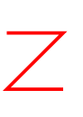


See this code [live on jsFiddle](http://jsfiddle.net/raphaeljs/RnBMA/).

在线代码演示请参考: <http://jsfiddle.net/raphaeljs/RnBMA/>

If you’re fuzzy on why the browser understands `#F00` as the color red, read up on “hexadecimal color codes.”

如果不熟悉红色的表示方法 `#F00`, 请搜索 “十六进制颜色”。

Just to see what happens, let’s also add some interior color:

试试填充色:

```
mark.attr("fill", "#00C");
```


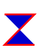


Hmmm. Since a *Z* is not a “closed” figure, in which the last point rejoins the first, Raphael guesses what to fill in by drawing an imaginary line from the end point to the starting point and then filling in anything that’s bounded on all sides by lines. (This is in stark contrast to the old days of Microsoft Paint, when the fill tool would paint the entire screen if there was even a single pixel missing along the perimeter of your shape.) While the computer is reasonably smart about guessing what to do in these circumstances, it’s much better to just complete your shapes if you want them to have some internal color.

因为 **Z** 不是一个“封闭”的图形, 终点又回到了起点, Raphael画了一条不存在的虚线, 从终点到起点, 然后边界就确定了, 接着在其中进行填充。

(与Windows自带的Microsoft Paint画图工具形成了鲜明的对比, 在画图工具中, 如果填充的不是封闭区域, 则会将整个画布都填充上指定的颜色)。在这些情况下系统会很聪明地猜测用户想要做什么, 如果想要填充内部, 最好形成封闭区域。

To do so, you could just add a final `L10,30` command to the end of the path string, thus drawing a final line that reconnects with the original. The path syntax also offers a convenient command to do the same thing. If you end your path with a `z`, it connects to the beginning automatically. Let’s try it alongside an alternate syntax for the path, just to make sure I was telling the truth above:

可以在path末尾添加 `L10,30` 指令, 绘制一条线到起点坐标。当然,path提供了一种简写的语法, 在最后加上一个字母 `z`, 会自动连接到起始坐标点。 来看看效果:

```
var paper = Raphael(0,0,300,300);
var d = "M10 30L60 30L10 80L60 80z";
var mark = paper.path(d);
```


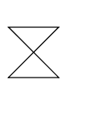


### RELATIVE PATHS

### 相对路径

The commands `M` and `L` have younger siblings, `m` and `l`, which function identically except for one key factor: they understand coordinates to be relative to the previous coordinate. We could achieve the exact same *Z* in a more intutive manner like this:

命令`M`和`L` 有对应的小写形式 `m`和`l`, 功能是一样的, 区别在于小写的指令表示相对坐标, 也就是相对于前一个坐标的差值。我们可以使用更好理解的格式来实现前面的 **Z** 字图形:

```
# 此处小写的 l 字母可能在某些字体下与数字一不容易区分.
var d = "M10,30 l50,0 l-50,50 l50,0";
```


We started at the same point—using a lowercase `m` here would be meaningless since we don’t have a starting point to be relative to—and then told the computer to move its imaginary pen 50 pixels to the right and zero pixels up, then to the left 50 and down 50, then 50 to the right again.

在起始处使用小写的 `m` 与大写的并没有什么区别，因为还没有一个相对的点。然后告诉计算机,（l50,0）向右移动50像素,向下0像素划直线; 然后（l-50,50）, 划直线向左50, 向下50; 然后（l50,0）, 再向右划线50像素。

For simple cases like this one, it’s often much easier to use relative coordinates. In other cases, you’ll have predetermined points on the screen that you’ll want to connect without doing the math of how far apart they are relative to one another. It’s up to you, and you can mix and match capital and lowercase letters in the same string.

对于简单的情况, 使用相对坐标会更容易理解和使用。 但在其他情况下, 可能需要从一个点，连线到另一个确定的点。 根据具体情况、由编码人员决定使用哪种方式, 又或者在同一个path字符串中混合大小写字母的方式。

There are two more commands that make life a little easier: `H`, `V`, and their tagalong siblings `h` and `v`, for “horizontal” and “vertical.” These commands only expect one number to follow them, and assume the other is zero. We can simplify our *Z* again like so (I’ve mixed in a capital and lowercase `H` for demonstration):

还有两个更方便的命令: `H`,`V`, 以及小写形式:`h`和`v`, 分别表示“horizontal(水平)” and “vertical(垂直).”
这两个命令只处理自身后面的一个参数/数字, 多余的会被忽略。 使用大小写的形式来实现同样的 **Z**:

```
var d = "M10,30h50l-50,50H60";
```


## Hopping Around

## 移动画笔

Paths should always begin with an `M`. But if you need to “pick up the pen” during the course of drawing a path to jump to another spot, you can also use the `M` or `m` in the middle of the string. Here’s a capital *I*:

Path一般来说都是以 `M` 开头。但如果在绘制的过程中, 需要“提起画笔”转到另一个点绘制, 也可以在中途使用`M`或`m`来定位。下面的图形是一个大写的字母 **`I`**:

```
var I = paper.path("M40,10h30m-15,0v50m-15,0h30");
```


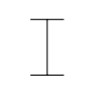


This is another example where the relative coordinates that come using lowercase letters are very convenient. But just for practice, let’s make the same *I* using only “absolute” coordinates:

这个例子中可以看到, 使用小写字母形式的相对坐标还是非常方便。 此处为了练习, 让我们使用“绝对”坐标来画一个大写的 **`I`**:

```
var I = paper.path("M40,10H70M55,10V60M40,60H70")
```


Let’s say we want to make some solid shapes, like this irregular triangle, beginning from the lower right vertex:

假设我们想做一些立体图案, 比如下面的不规则三角形, 从右下角开始画:

```
var d = "M90,90l-80,-20L50,5L90,90";
var tri = paper.path(d).attr({
    "fill": "yellow",
    "stroke-width": 5
});
```


Since we were careful to make the last point the same as the first, there is no ambiguity as to what should get filled in. Here we have something that looks like a yield sign restructured by a driver who did not, in fact, yield:

因为我们让最后的坐标点和起始点坐标一致, 所以要填充的区域没有任何疑问。这个图形看起来有点像提示司机的警示牌:

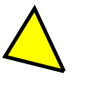


Again, we can freely mix uppercase and lowercase letters in a path string, though doing so may not contribute to one’s sanity during the creation of complex shapes.

这里在一个path字符串中自由组合了大写和小写字母, 尽管这样做可能不会对构建复杂图形有什么帮助。

Behind the scenes, Raphael stores paths as an array in which each object represents one command of a letter and some numbers. If you were to add the line `console.log(tri)` at the end of the previous example and examine your code in Firebug, you would see something like this:

在底层实现中, Raphael将path保存为一个数组, 数组中的每个对象包括一个字母命令和一些数字。如果使用 `console.log(tri)` 来输出日志信息, 则可以在控制台展开 `tri.attrs.path` 看到类似的结果:

```
[Array[4]]
    0: Array[3]
        0: "M"
        1: 90
        2: 90
        length: 3
    1: Array[3]
        0: "L"
        1: 10
        2: 70
        length: 3
    2: Array[3]
        0: "L"
        1: 50
        2: 5
        length: 3
    3: Array[3]
        0: "L"
        1: 90
        2: 90
        length: 3
```


The careful reader will note that Raphael converted the second point to absolute coordinates when converting the string to the array.

细心的读者会注意到, Raphael在转换字符串数组时, 已经将第二个点转换成了绝对坐标的方式。

It’s useful to understand how Raphael stores paths for the purpose of debugging and getting information about the path after the fact. (Perhaps you want the coordinates of the first and last point in order to draw some objects at either end of a line.) In fact, you can choose to deliver a path command to Raphael in this format as well. You can get the same irregular triangle in the above example using the array form:

了解Raphael存储path的方式是很有用的, 方便调试或者进行BUG的跟踪排查. (比如获取第一个点和最后一个点的坐标, 在这条线的两端绘制一些东西)。事实上,我们也可以将数组格式的path命令传给Raphael。 例如下面的代码, 绘制出来的效果和上面示例中的不规则三角形一样:

```
var tri = paper.path([["M", 90, 90], ["L", 10, 70], ["L", 50, 5], ["L", 90, 90]]);
```


I personally find it easier and more concise to use the string format and let Raphael deal with converting it to an array, but the choice is yours.

我个人觉得，用字符串的方式更方便，也更简洁, 把繁琐的转换交给Raphael来处理, 当然，根据具体情况自己选择。


### POLYGONS

### 绘制多边形(Polygons)

Given how common rectangles are in design, it makes sense for Raphael to offer a `.rect()`function, even if it duplicates what can be done with paths with a few more lines. (Actually, this is a decision baked into the SVG specifications, not a shortcut unique to our library.) It would be highly inefficient, on the other hand, for Raphael to offer a `.pentagon()`, `.hexagon()`, and so forth. Fortunately, we now know enough to make any regular polygon we like. Let’s write a function to make a polygon of `N` sides centered around an arbitrary point. It’s going to take a very small amount of trigonometry—three lines, I think—but we’ll get through it together. The function we’re going to write will take the center coordinates (like a circle or ellipse), the number of sides in our regular polygon, and the length of the sides, and return the path as a string.

为了方便, Raphael 提供了 `.rect()` 函数来绘制矩形, 虽然我们用 path 也可以多画几条线拼凑出来。(事实上, 是因为底层的SVG规范就允许这样做, 而不是Raphael独有的快捷方式)。

假如Raphael提供五边形 `.pentagon()`、六边形 `.hexagon()` 之类的快捷方法, 也不能提升多少工作效率。 

好消息是, 现在我们知道如何绘制任意边数的正多边形的绘制方法了。

下面我们编写一个函数来绘制 `N` 条边的正多边形, 并指定一个点作为中心点。 这需要一点三角函数(trigonometry)的知识, 代码中也会进行适当的注释。我们要写的函数将中心坐标(如一个圆或椭圆),我们正多边形的边数,两边的长度,作为一个字符串并返回路径。

```
// 多边形(x,y, 边数N，边长side|r)
function NGon(x, y, N, side) {
    // 为了好理解, 在中心画一个圆点
    paper.circle(x, y, 3).attr("fill", "black");

    var path = "", n, temp_x, temp_y, angle;
    // N+1个点; 保证封闭(0-N)
    for (n = 0; n <= N; n += 1) {
        // 把一个圆(360度)N等分，每条边对应的角度, 依次往右加 1/N. 
	// 类似-时钟-顺时针-60等分；
	// angle(角度), 使用弧度(radians)表示法;
        angle = n / N * 2 * Math.PI;
        // x + side(半径)*三角函数cos
        temp_x = x + Math.cos(angle) * side;
        // y + side(半径)*三角函数sin
        temp_y = y + Math.sin(angle) * side;

        // 第0个点是 "M", 后面的是 L
        path += (n === 0 ? "M" : "L") + temp_x + "," + temp_y;
    }
    return path;
}
```


Let’s fire this baby up with a few different values and see how we did.

让我们绘制几个不同的多边形。

```
var paper = Raphael(0, 0, 800, 600);

paper.path(NGon(40, 120, 4, 30));
paper.path(NGon(40, 200, 5, 30));
paper.path(NGon(40, 40, 6, 30));
paper.path(NGon(130, 60, 9, 40));
paper.path(NGon(240, 160, 25, 80));
// 可以看到，25条边的正多边形，r=80的时候，和圆形的差别不是很大了
```


See this code [live on jsFiddle](http://jsfiddle.net/raphaeljs/U9bxc/).

在线代码示例请参考: <http://jsfiddle.net/raphaeljs/U9bxc/>

看看效果:

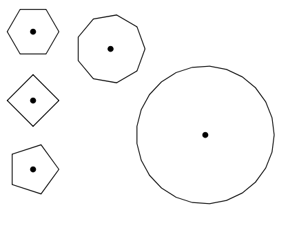


As you see, a 25-sided polygon is pretty close to a circle, as we might expect. You might even say a circle is a polygon with infinite sides. From there, *RaphaelJS* will leave you to your musings.

可以看到，25条边的正多边形，r=80的时候，和圆形的差别不是很大了。 甚至可以说, 圆就是一个边数无限大的多边形。 现在，可以静下心来好好想一想。

## Curves

## 绘制曲线(Curves)

Drawing lines that bend and curve is necessarily more difficult in Raphael because you have more decisions to make. So we’re drawing a curve from point A to point B. Should it curve up or down? By how much? Is it symmetrical?

用Raphael绘制折线(bend)和曲线(curve)的难度肯定会更高。画线弯曲和Raphael曲线必然是更加困难, 因为需要设定更多的条件。比如从A点到B点绘制一条曲线, 那是要向上凸还是要向下凹呢? 弯曲度有多少? 是不是对称曲线? 等等等等。

> 曲线(curve)是更优雅的折线(bend), 曲线一般无角;

The SVG specifications offer a couple of different commands for curves, but the documentation is pretty miserable. In this chapter, we’re going to cover the most intuitive type, the ellipitical curve.

SVG规范提供了多个命令来处理曲线, 但文档是枯燥晦涩的。 下面介绍最直观的类型, 椭圆曲线(ellipitical curve)。

### THE `A` COMMAND: ELLIPTICAL CURVES

### 椭圆曲线与`A`命令

As you might predict, this command creates curves that look like segments taken from an ellipse. As such, they require a few peices of information. Don’t worry if this is confusing at first. It’s naturally confusing, but a few examples will illuminate these parameters.

可以想象, 这个命令创建的曲线, 看起来像是从椭圆上截取下来的一段弧。因此需要输入一些信息，不要担心太难、下面的几个例子会带你解开困惑。

Like lines, elliptical curves begin at the point where the previous command left off.

和直线(line)类似、椭圆曲线(elliptical curves)的起始点也是前一个命令到达的位置。

An `A` command looks like this: `A 50,75 0 0,1 400,200` Those numbers represent:

`A`命令看起来是这样的: `A 50,75 0 0,1 400,200`, 这些数字的含义为:

- The horizontal and vertical radii of the imaginary ellipse we’re using as a guide
- An angle rotating the curve’s axis (for advanced users)
- A Boolean value (or “flag”) that is either `0` or `1`, representing whether a curve goes clockwise or counterclockwise
- A Boolean value (or “flag”) representing whether the curve goes the long way or the short way
- The ending point

- 椭圆对应的水平半径和垂直半径(vertical radii)长度。
- 椭圆(轴)的旋转角度(高级效果)
- 表示曲线顺时针(clockwise)还是逆时针(counterclockwise)的布尔值/标志位(`0`或`1`)
- 表示曲线是长端（long way）还是短端(short way)的布尔值/标志位(`0`或`1`)
- 终点(ending point)的坐标值

To explore what this means, we’re going to start with a point at `[50, 50]` and end at a point at `[200, 125]`. Let’s draw that and make some dotted lines for reference:

先做点准备工作, 从坐标点 `[50, 50]` 开始、到坐标点 `[200, 125]` 结束，画一些虚线把方框标示出来:

```
var paper = Raphael(0, 0, 500, 400);
var starting_point = paper.circle(150, 150, 4).attr({ fill: "green", stroke: 0 });
var ending_point = paper.circle(250, 220, 4).attr({ fill: "red", stroke: 0 });

var path1 = paper.path("M 150,150 L 250,150 L 250,220").attr(
"stroke-dasharray", ".");
var path2 = paper.path("M 150,150 v 70 h 100").attr("stroke-dasharray", "-");
```


So far, so good:

OK，看看这部分代码的效果:

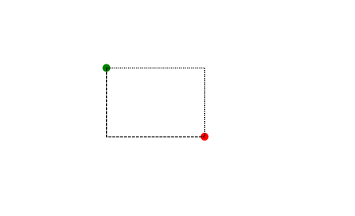


Let’s try an elliptical arc with the angle and these two mysterious boolean values set to zero. We’ll use the length and the height of this rectangle as the radii.

我们试着画一个椭圆，将旋转弧度，以及两个布尔值都设置为0, 并用矩形的宽高作为椭圆的半径。

```
// blue, 蓝色
var curve1 = paper.path("M150,150 A100,70 0 0,0 250,220")
                .attr({"stroke-width": 2, stroke: "blue"});
```


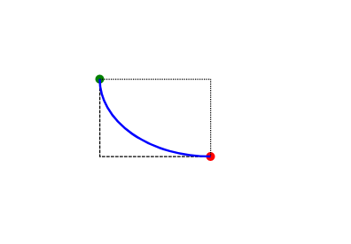


Nice—we have a beautiful sloping curve connecting the points. Let’s see what happens when we set the first flag to `1` instead of `0`:

哈哈，可以看到，一条美丽的曲线连接了这两个点。如果将第一个标志位改成`1`, 会是什么效果呢:

```
// cyan, 蓝绿色
var curve2 = paper.path("M150,150 A100,70 0 1,0 250,220")
                .attr({"stroke-width": 2, stroke: "cyan"});
```


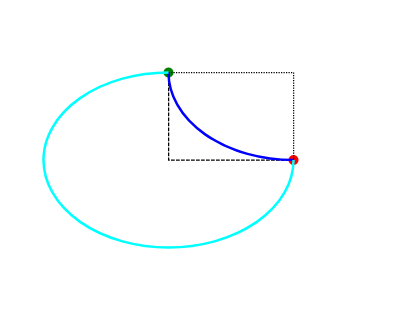


Whoa. The starting and ending points are the same, and we’re still following the path of an ellipse with the same radii, but we went the long way. The SVG specification calls this the “long arc flag,” but I like to call it the “detour value.” If the detour value is zero or false, the curve takes the shorter path to the destination. If it’s one, it takes the longer path.

嗯! 弧线的起点和终点和前面的一样, 椭圆半径也一样, 但起点到终点的路径变成了长的那一段（long way）. SVG规范称之为“长弧标志(long arc flag)”， 但我喜欢称之为“绕路标志(detour value)”。 如果绕路标志为 `0`或者`false`, 则选择到目的地较短的路径.如果标志位是 `1`, 则选择更长的路径。

Let’s try the other flag, setting the detour flag back to `0`:

我们再试试第二个标志位改为 `1`, 当然, 把绕路标志改回 `0`:

```
// pink, 粉红色
var curve3 = paper.path("M150,150 A100,70 0 0,1 250,220")
                .attr({"stroke-width": 2, stroke: "pink"});
```


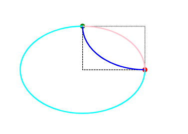


This is the same as the first curve, but it takes a clockwise path instead of counterclockwise path. This is officially known as the “sweep flag,” but I like to think of it as the “clockwise flag.” You may notice that curve 3 “completes” curve 2, since its flags have opposite values.

和第一条曲线、蓝色的那条类似, 但这次是顺时针路径, 而不是逆时针。 官方称为“下摆标志(sweep flag)”,但我觉得这是“顺时针标志位”. 你可能也看到了, 曲线3和曲线2完成了互补, 这是因为他们的两个标志位取值恰好相反。

Can you guess what our last combination of flags looks like? If you said “a clockwise flag that takes the long way to get to its final destination,” you were correct:

你应该能猜出我们最后想要的标志位组合了? 没错，就是“同样的坐标点，将标志位换成顺时针标志位、搭配长路径标志位”:

```
// orange, 橙色
var curve4 = paper.path("M150,150 A100,70 0 1,1 250,220")
                .attr({"stroke-width": 2, stroke: "orange"});
```


Put together, we see that the four combinations describe the two ways an ellipse with an `x`radius of 100 and a `y` radius of 70 can intersect our starting and ending points:

我们看到, 这四个path组合起来，展示的是两个不同的椭圆，他们的水平半径(`x`轴)都是100、垂直半径(`y`轴)都是70, 并且在起点和终点坐标处相交:

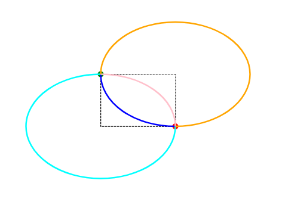


See this code [live on jsFiddle](http://jsfiddle.net/raphaeljs/T8C8p/).

在线代码请参考: <http://jsfiddle.net/raphaeljs/T8C8p/>

What about that fifth parameter, the angle, that we’ve so far been setting to zero? It’s a common mistake to assume that this is the angle that the curve traverses, but this is not the case. That angle is calculated automatically based on the radii and the end point—no further information is needed. The angle that you set explicitly will rotate the imaginary ellipses. The easiest way to express this is visually. Let’s take the four arcs we just drew and rotate each of them by 45 degrees:

那么第五个参数是什么意思呢, angle, 角度, 前面的示例中这个参数一直都是 `0`。 
这是角度经常会被误认为曲线旋转的角度, 但实际上曲线旋转的角度是基于半径和结束坐标点自动算出来的 —— 并不需要手工指定。 我们明确指定的这个角度, 是椭圆最终旋转的角度, 看下面的示例应该会比较容易理解。 让我们将这四条弧线都旋转45度:

```
var curve1 = paper.path("M150,150 A100,70 45 0,0 250,220")
                .attr({"stroke-width": 2, stroke: "blue"});
var curve2 = paper.path("M150,150 A100,70 45 1,0 250,220")
                .attr({"stroke-width": 2, stroke: "cyan"});
var curve3 = paper.path("M150,150 A100,70 45 0,1 250,220")
                .attr({"stroke-width": 2, stroke: "pink"});
var curve4 = paper.path("M150,150 A100,70 45 1,1 250,220")
                .attr({"stroke-width": 2, stroke: "orange"});
```


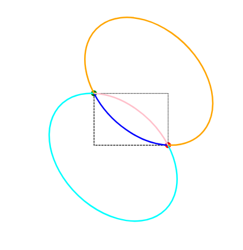


See this code [live on jsFiddle](http://jsfiddle.net/raphaeljs/T8C8p/1/).

在线代码请参考: <http://jsfiddle.net/raphaeljs/T8C8p/1/>

As we can see, we have identically sized ellipses passing through the same points, and then rotated. It’s actually a pretty neat geometric property, but I find it difficult to visualize. That said, I confess that I have never once found the need to rotate my elliptical curves in the wild.

可以看到, 画出了两个大小相同的椭圆, 都经过那两个点, 并且有45度的角度偏转。这是一个相当简洁的几何属性, 但我觉得很难在脑海里进行想象. 我承认, 我从未想过椭圆曲线还能这样旋转。

## The `C` Command: Cubic Bézier Curves

## `C`命令与三次贝塞尔曲线

The elliptical curve is extremely useful in schematics and other geometric drawings. Most of the curves we observe in art and nature, however, do not neatly fit along the path of an ellipse. In these cases, we make use of the cubic Bézier curve.

椭圆曲线是非常有用的在图表和其他几何图画。大部分的曲线我们观察在艺术和自然,然而,不整齐地沿着一个椭圆的道路.在这些情况下,我们利用三次贝塞尔曲线。

The `C` command takes three pairs of coordinates: the destination and two *control points* that determine how the line bends. In most cases, the curve does not pass through these control points. Instead, we can think of them as invisible magnets that pull the line in their direction as it travels to its destination. This is best illustrated with a few examples in which we will place black dots over the control points for educational purposes.

的`C`命令以三双坐标:目的地和两个* *控制点,确定弯曲。在大多数情况下,曲线不经过这些控制点.相反,我们可以把它们作为无形的磁铁,把线的方向,因为它将前往目的地.这是几个例子最能说明我们将黑点在控制点用于教育目的。

To draw a cubic Bézier curve, one supplies these two control points first and then the destination as the third coordinate. Like all of the other SVG paths, it begins wherever the previous command left off.

画一个三次贝塞尔曲线,一个供应这两个控制点,然后目标作为第三个坐标.像所有其他的SVG路径,它开始在前面的命令。

```
var paper = Raphael(0,0,500,500);

// draw the control points for educational purposes
var cp1 = paper.circle(100, 50, 4).attr("fill", "black");
var cp2 = paper.circle(200, 150, 4).attr("fill", "black");

// draw the bezier curve
var path = "M 50,100 C 100,50 200,150 250,100";
paper.path(path);
```


See this code [live on jsFiddle](http://jsfiddle.net/raphaeljs/JpNvt/).

看到这段代码(住在jsFiddle)(http://jsfiddle.net/raphaeljs/JpNvt/)。


This path begins at coordinates (50,100) and ends up at (250,100), just like a regular old `L` path. For the first two arguments, I set one control point above the line to the right of the starting point and a second one below and to the left.

这条路开始于坐标(50100)和结束(250100),就像一个普通老了`L`路径。第一两个参数,我上面设置一个控制点线的右边下面的出发点和第二个,左边。

If I move the first contol point to be below the starting point as well, at the same `x`position, the curve assumes a more familiar shape:

如果我移动第一个控制点下面的起点,在相同的`x`曲线的位置,假设一个更熟悉的形状:

```
var paper = Raphael(0,0,500,500);
var cp1 = paper.circle(100, 150, 4).attr("fill", "black");
var cp2 = paper.circle(200, 150, 4).attr("fill", "black");

var path = "M 50,100 C 100,150 200,150 250,100";
paper.path(path);
```


These examples both have some flavor of symmetry, but there’s no reason the points need to reflect one another. Here’s a wackier example:

这些例子都有一些对称的味道,但没有理由的点需要反映。这是一个怪的例子:

```
var paper = Raphael(0,0,500,500);
var path = "M 50,100 C 50,50 300,250 250,100";
var cp1 = paper.circle(50, 50, 4).attr("fill", "black");
var cp2 = paper.circle(300, 250, 4).attr("fill", "black");
paper.path(path);
```


## Exotic Paths

## 异国情调的路径

The [SVG path specifications](http://bit.ly/path-specs) contain several more advanced commands for Bézier-like curves that reflect back on themselves. I will freely admit that I’ve never once found a use for any of them. Should you wish to dive in, an understanding of control points is all you need to get a sense for how they work. You can see a [lovely interactive example](http://jsfiddle.net/raphaeljs/Mfzn8/) on jsFiddle of one such exotic curve that allows you to manipulate the control points with your mouse.

(SVG路径规范)(http://bit.ly/path-specs)包含一些更高级的命令Bezier-like曲线反映自己.我会坦率地承认,我从来没有发现一个用其中任何一个。如果你想潜水,控制点的理解都是你需要了解它们是如何工作的.你可以看到一个可爱的互动的例子(http://jsfiddle.net/raphaeljs/Mfzn8/)jsFiddle的这样一个奇异的曲线,让您与您的鼠标操作控制点。

## Case Study: Play Ball!

## 案例研究:玩球!

We have a few other types of curves to cover, but I’d like to point out that, halfway through Chapter 4—and that includes the Introduction, where you didn’t even learn anything—we have already accumulated the skills to draw a baseball field.

我们有一些其他类型的曲线,但是我想指出,中途4章,包括引言,你甚至没有学习任何我们已经积累了画一个棒球场的技能。

Looking over Major League Baseball’s [official rules](http://atmlb.com/rules-list), it looks like the minimum allowable distance from home plate to the foul pole is 250 feet. To make our visualization maximally flexible, let’s set that value as a variable, along with one for the scale of the graphic and point of origin for home plate:

窥探Baseball’s联盟少校over http://atmlb.com/rules-list]([官方rules looks like it)allowable距离from the home平坦的最低foul格is to the feet 250.为了使我们的可视化最大限度地灵活,让我们将这个值设置为一个变量,以及一个用于图形的规模和本垒的原点:

```
//pixels per foot
var paper = Raphael(0, 0, 500, 500),
    SCALE = 1,
    HOME_PLATE = { x: 250, y: 350 },
    FOUL_POLE = 250;
```


Of course, SVG graphics are meant to scale without us hard-coding a scaling factor. I find it convenient to define one in the code for situations like this, where there is an explicit scale between the screen and a real world object, whether it’s a stadium or a solar system. We can always scale the whole graphic again down the road if need be.

当然,SVG图形是为了规模没有我们硬编码一个比例因子.我发现它方便代码中定义一个在类似这样的地方,哪里有一个显式的规模之间的屏幕和一个真实世界的对象,无论是球场或太阳系.我们总是可以规模再整个图形如果需要。

You’ll notice I use some uppercase variables. This is a personal convention of mine in JavaScript that I reserve for numerical values that are constant over the lifetime of the program, but that I may wish to alter by hand to change the specs of the graphic. It has no role whatsoever in determining how the program sees the variables. I’ve also stored the `x`and `y` coordinates of home plate in a simple object, rather than taking the time to write `HOME_PLATE_X` and `HOME_PLATE_Y`.

你会注意到我使用一些大写的变量.这是我的一个个人约定在JavaScript中,我保留恒定的数值程序的生命周期,但我希望改变手工改变图形的规格。它已经没有任何作用在决定如何项目将变量。我也存储了`x`和`y`本垒的坐标在一个简单的对象,而不是花时间写`HOME_PLATE_X`和`HOME_PLATE_Y`。

Okay, let’s make a shape that outlines the field. To draw the foul lines, we’ll start at the position of home plate and draw the line 250 pixels to the left field foul pole. This involves a little trigonometry.

好的,让我们做一个形状轮廓。画犯规线,我们将从本垒和画线的位置250像素的左外野犯规.这涉及到一个小三角。

The foul pole is 45 degrees to the left if you’re standing on home plate facing the pitcher. JavaScript’s trig functions need that in radians—that is, π/4.

犯规极是左侧45度,如果你站在本垒面临的投手。JavaScript的三角函数需要在radians-that,π/ 4。

```
var foul_line_left = "M" + HOME_PLATE.x + "," + HOME_PLATE.y + "l"
    + -1 * FOUL_POLE * Math.cos(Math.PI / 4) + ","
    + -1 * FOUL_POLE * Math.sin(Math.PI / 4);
```


Instead of hardcoding the numbers into the paths, as we did in the first examples, it’s generally easier to compute the strings you’ll pass to Raphael by making a string from numerical variables and the required function, as above. If you’re used to “strongly typed” languages like Java or Python, which throw an error when you try to add variables of different types, this will look like trouble. JavaScript is “weakly typed,” so it’s fine with adding numbers to strings, converting them to text in the process.

而不是硬编码的数字到路径,正如我们在第一个示例中所做的一样,通常更容易计算字符串你传递给Raphael通过一个字符串从数值变量和所需的函数,如上所述.如果你习惯“强类型语言,像Java或Python,它抛出一个错误当你试图添加不同类型的变量,这将看起来像麻烦.JavaScript是“弱类型”,所以它很好添加数字字符串,将它们转换为文本。

(Not that we make the `x` and `y` distances after the lowercase “l” negative because we’re going left and up relative to home base.)

(不是我们的`x`和`y`距离后小写字母“l”-因为我们左和相对于基地。)

Now let’s draw an arc along the outfield fence to the other foul pole:

现在让我们画一个弧沿外场栅栏其他犯规杆:

```
    var outfield_fence = "a" + FOUL_POLE + "," + FOUL_POLE + " 0 0,1 "
        + 2 * HOME_PLATE.x * Math.sin(Math.PI / 4) + "," + 0;
```


We’re using the foul pole distance as the radius, meaning home plate will form the center of the circular ellipse describing the fence. We do not want to take the long route, so we set the first flag to `0`, but we do want to go clockwise, so we set the second one to `1`.

我们使用犯规杆的距离为半径,本垒将形成圆形的中心意义描述栅栏的椭圆.我们不想把长的路线,所以我们组第一个国旗`0`顺时针,但是我们想去,所以我们设置第二个`1`。

Last, we’ll draw a line back to where we started, using the capital L for convenience:

最后,我们将会回到我们开始画一条线,使用资本L为了方便:

```
    var foul_line_right = "L" + HOME_PLATE.x + "," + HOME_PLATE.y;

    var field = paper.path(foul_line_left + outfield_fence + foul_line_right)
        .attr({ stroke: "none", fill: "green" });
```


Looking good so far, though the center field fence looks a little close to me. We can remedy this by extending the second radius in the arc:

看上去不错,到目前为止,虽然中心现场围栏看起来有点接近我。我们可以补救这通过扩展第二弧半径:

```
    var outfield_fence = "a" + FOUL_POLE + "," + 1.5 * FOUL_POLE + " 0 0,1 "
        + 2 * HOME_PLATE.x * Math.sin(Math.PI / 4) + "," + 0;

    var field = paper.path(foul_line_left + outfield_fence + foul_line_right)
        .attr({ stroke: "none", fill: "green" });
```


Much better. Now let’s make a square infield representing the basepaths and put some bases on it. To do so, we could make a path that starts at home and then goes 90 feet (pixels) northwest, then northeast, then southeast, then back to home. That would involve a lot of trig. I have a better idea that harkens back to [Chapter 2](https://learning.oreilly.com/library/view/raphaeljs/9781449365356/ch02.html): let’s just draw a square and rotate it into position.

好多了。现在让我们做一个正方形代表basepaths田园和放一些基地.为此,我们可以在家里开始的路径,然后是90英尺(像素)西北,东北,东南,然后回到家里。这将涉及大量的三角.我有个更好的主意,回归本源(第二章)(https://learning.oreilly.com/library/view/raphaeljs/9781449365356/ch02.html):我们先画一个正方形和旋转位置。

First we’ll construct the infield using home plate as an origin and not worrying about rotation. This [handy HTML color table](http://bit.ly/html-colors) suggests that `#993300` is a nice dirt color.

首先我们将构建耕地使用本垒作为起源和不担心旋转。这(方便的HTML颜色表)(http://bit.ly/html-colors)表明`#993300`是一个很好的泥土的颜色。

```
    var infield = paper.set();

    infield.push(paper.rect(HOME_PLATE.x, HOME_PLATE.y, 90, 90)
        .attr({stroke: "none", fill:             "#993300"}));

    infield.attr("transform", "R-135 " + HOME_PLATE.x + " " + HOME_PLATE.y);
```


For the bases, I’m going to make a loop that iterates four times and draws a base on each corner. (Yes, we’re cheating and make home plate a square, but you do have the capacity to draw one using paths for extra credit.)

基地,我要做一个循环迭代的四倍,画了一个基础上每一个角落.(是的,我们作弊,让本垒广场,但你有能力使用路径画一个额外学分)。

```
    //bases
    for (var c = 0; c < 4; c += 1) {
        infield.push(paper.rect(HOME_PLATE.x + 85 * (c % 2), HOME_PLATE.y + 85 * (c >= 2), 5, 5)
            .attr({stroke: "none", "fill": "white"}));
    }
```


Note that `85 * (c / 2 >= 1)` make use of the fact that a true/false statement resolves to zero or one.

请注意,`85 * (c / 2 >= 1)`

To swing the infield into place, we’ll rotate it 135 degrees, using home plate as the pivot point:

摇摆的田园到位,我们会旋转135度,使用本垒作为轴心点:

```
    infield.attr("transform", "R-135 " + HOME_PLATE.x + " " + HOME_PLATE.y);
```


See this code [live on jsFiddle](http://jsfiddle.net/raphaeljs/46JJu/).

看到这段代码(住在jsFiddle)(http://jsfiddle.net/raphaeljs/46JJu/)。

Beautiful! Of course, a real baseball field is much more refined, with dirt extending in a radius from the pitcher’s mound, grass in foul territory, and so forth. I’ll leave it as an exercise to the ambitious reader to extend this example. The point is, there is nothing about a baseball diagram that you cannot replacate with your current Raphael toolset.

漂亮!当然,一个真正的棒球场更雅致,与泥土扩展半径从投手土墩,草在界外,等等.我将把它作为练习留给读者雄心勃勃的扩展这个示例。问题是,没有对棒球图,你不能用你当前replacateRaphael工具集。

## Final Thoughts

## 最终的想法

You might be thinking: Wait, why did I mess around with all that trigonometry if I could have drawn the entire field on its side, with the left-field foul line perfectly horizontal, and then rotated the field 45 degrees, not unlike the strategy for drawing the diamond? To that I respond: Please file all complaints by snail mail.

你可能会想:等等,为什么我浪费时间与所有三角如果我能画的整个领域,垒犯规线完美的水平,然后旋转45度,不像画钻石的策略吗?我回复:请文件所有投诉蜗牛邮件。

Actually, that’s a fantastic idea. In fact, that’s precisely what engineers do all the time, applying a transformation to a dataset that makes it easier to work with. Both ways work, and the best route is always the one that you’re able to best visualize and understand. People who think more conceptually might like to draw the lines in the locations that they will ultimately appear. Those who think geometrically might prefer to draw something on its side, where diagonal lines become straight lines, and then rotate it. Coding is a collaborative process between your mind and the computer’s mind, and happy programmers are ones who find the ideal meeting point.

实际上,这是一个好主意。事实上,这正是工程师做所有的时间,变换应用于一个数据集,使它更容易使用.两方面的工作,最好的路线是总是一个,最好你能想象和理解.人认为更多的概念可能会喜欢画线的位置,他们最终会出现.那些认为几何可能更喜欢画东西,对角线变成直线,然后旋转它.编码是一个协作的过程之间思维和计算机的思维,和快乐的程序员的人找到理想的会议。

